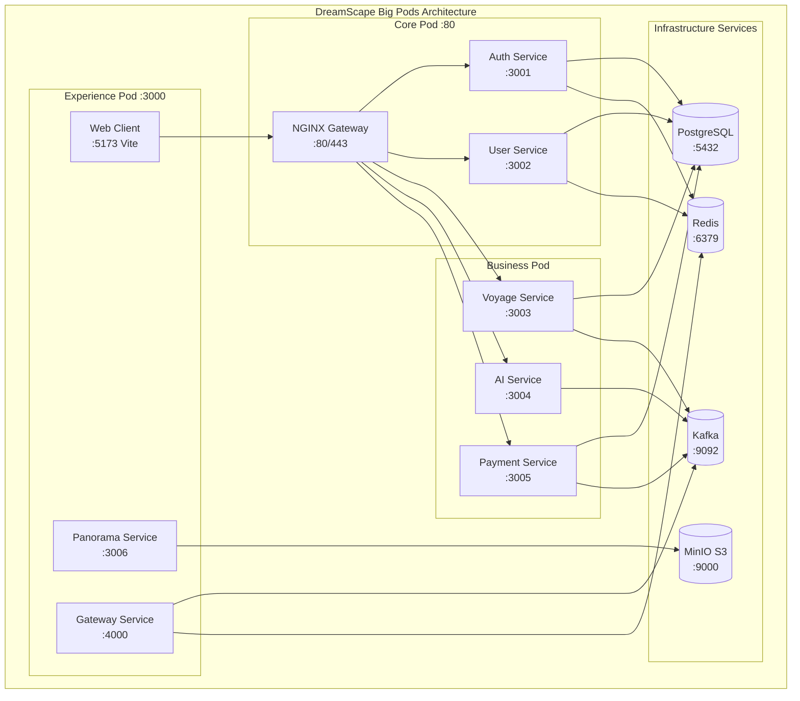
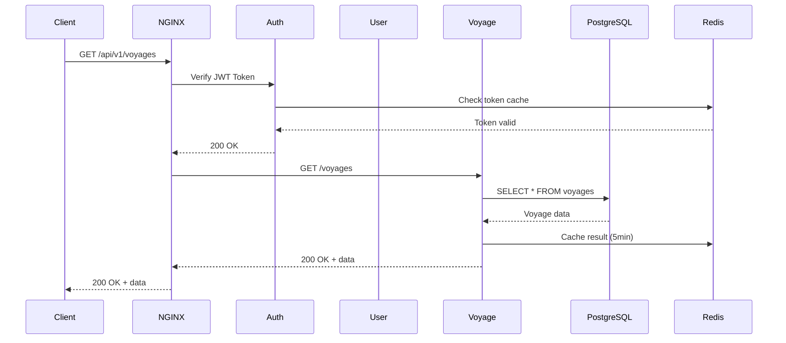
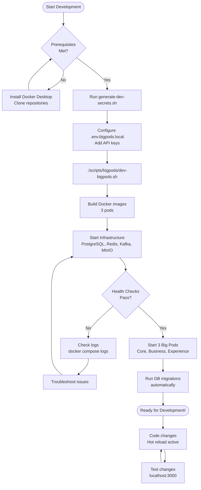

# DreamScape Big Pods Development Environment

Complete local development setup for DreamScape's hybrid architecture: **6 repositories → 3 Big Pods**

> **⚠️ NOT FOR PRODUCTION USE**
> This setup is **optimized for local development only**. For production deployment, use the K3s/Kubernetes configuration in `/k3s` directory with proper security, scaling, and monitoring.

## Architecture Overview



### Request Flow



### Big Pods Structure

- **Core Pod**: Authentication, user management, NGINX gateway
  - Port 80/443: NGINX Gateway
  - Port 3001: Auth Service
  - Port 3002: User Service

- **Business Pod**: Voyage planning, AI generation, payments
  - Port 3003: Voyage Service
  - Port 3004: AI Service
  - Port 3005: Payment Service

- **Experience Pod**: Frontend, VR panorama, WebSocket gateway
  - Port 3000: Web Client (Vite dev server)
  - Port 5173: Vite HMR
  - Port 3006: Panorama Service
  - Port 4000: Gateway Service

## Deployment Flow



## Quick Start

### Prerequisites

#### Required Software

| Software | Minimum Version | Recommended Version | Notes |
|----------|----------------|---------------------|-------|
| **Docker Desktop** | 20.10.0 | 24.0.0+ | For Windows/macOS users |
| **Docker Engine** | 20.10.0 | 24.0.0+ | For Linux users |
| **Docker Compose** | v2.0.0 | v2.20.0+ | Bundled with Docker Desktop |
| **Node.js** | 18.0.0 | 20.0.0+ | Optional, for local development |
| **Git** | 2.30.0 | Latest | For repository management |

#### System Requirements

| Platform | RAM | Disk Space | Notes |
|----------|-----|------------|-------|
| **Windows** | 8GB+ (6GB min) | 20GB+ free | WSL2 required, enable virtualization in BIOS |
| **macOS** | 8GB+ (6GB min) | 20GB+ free | Apple Silicon and Intel supported |
| **Linux** | 6GB+ | 20GB+ free | Any modern distro (Ubuntu 20.04+, Debian 11+, etc.) |

#### Platform-Specific Setup

**Windows:**
- Enable WSL2: `wsl --install`
- Docker Desktop → Settings → Resources → WSL Integration: Enable for your distro
- If using Git Bash, ensure line endings are set to LF: `git config --global core.autocrlf input`

**macOS:**
- Install via Homebrew: `brew install --cask docker`
- Docker Desktop → Settings → Resources: Allocate 8GB+ memory
- File sharing is automatic for `/Users` directory

**Linux:**
- Install Docker Engine: [Official Guide](https://docs.docker.com/engine/install/)
- Add user to docker group: `sudo usermod -aG docker $USER` (logout/login required)
- Install Docker Compose v2: `sudo apt install docker-compose-plugin` (Ubuntu/Debian)

### 1. Clone Required Repositories

The Big Pods setup expects this directory structure:

```
workspace/
├── dreamscape-infra/          # Infrastructure & deployment (this repo)
├── dreamscape-services/       # Backend microservices
│   ├── auth/
│   ├── user/
│   ├── voyage/
│   ├── ai/
│   └── payment/
└── dreamscape-frontend/       # Frontend applications
    ├── web-client/
    ├── panorama/
    └── gateway/
```

### 2. Configure Environment

```bash
# Copy the example environment file
cp .env.bigpods.example .env.bigpods.local

# Edit the file to add your API keys (optional for basic testing)
# Required for full functionality:
#   - AMADEUS_TEST_KEY / AMADEUS_TEST_SECRET (for voyage search)
#   - STRIPE_TEST_KEY (for payment processing)
#   - OPENAI_API_KEY (for AI features)
```

### 3. Start All Services

```bash
# From the dreamscape-infra directory
./scripts/bigpods/dev-bigpods.sh
```

The script will:
- Verify prerequisites (Docker, repositories)
- Create environment file if needed
- Build all 3 Big Pods
- Start infrastructure services (PostgreSQL, Redis, Kafka, MinIO)
- Wait for services to be healthy
- Display service URLs and credentials

**First-time setup takes 5-10 minutes**. Subsequent starts are much faster.

### 4. Verify Setup

Once started, access:
- **Web Application**: http://localhost:3000
- **API Gateway**: http://localhost/api/v1
- **MinIO Console**: http://localhost:9001 (user: dreamscape-dev, password: dreamscape-dev-secret)

## Service URLs

### Application Services

| Service | URL | Port | Description |
|---------|-----|------|-------------|
| Web Application | http://localhost:3000 | 3000 | Vite-powered React app |
| Vite HMR | http://localhost:5173 | 5173 | Hot Module Replacement |
| NGINX Gateway | http://localhost | 80 | Main API gateway |
| Auth Service | http://localhost:3001 | 3001 | Authentication & JWT |
| User Service | http://localhost:3002 | 3002 | User profiles |
| Voyage Service | http://localhost:3003 | 3003 | Travel planning |
| AI Service | http://localhost:3004 | 3004 | AI generation |
| Payment Service | http://localhost:3005 | 3005 | Stripe integration |
| Panorama Service | http://localhost:3006 | 3006 | VR panorama |
| Gateway Service | http://localhost:4000 | 4000 | WebSocket gateway |

### Infrastructure Services

| Service | URL | Port | Credentials |
|---------|-----|------|-------------|
| PostgreSQL | localhost:5432 | 5432 | user: `dev`, password: `dev123` |
| Redis | localhost:6379 | 6379 | No password |
| Kafka | localhost:9092 | 9092 | No auth |
| MinIO S3 | http://localhost:9000 | 9000 | access: `dreamscape-dev` |
| MinIO Console | http://localhost:9001 | 9001 | user: `dreamscape-dev`, password: `dreamscape-dev-secret` |

## Development Workflow

### Common Workflows

#### Workflow 1: Starting Your Development Day

```bash
# 1. Start all services
./scripts/bigpods/dev-bigpods.sh

# 2. Verify everything is running
docker compose -f docker/docker-compose.bigpods.dev.yml ps

# 3. Open your project and start coding
# Changes are automatically reloaded!

# 4. View logs in a separate terminal
docker compose -f docker/docker-compose.bigpods.dev.yml logs -f core-pod
```

#### Workflow 2: Testing a New API Endpoint

```bash
# 1. Create new endpoint in your service (e.g., auth service)
# File: dreamscape-services/auth/src/routes/users.ts

# 2. Hot reload will automatically restart the service (watch logs)
docker compose -f docker/docker-compose.bigpods.dev.yml logs -f core-pod

# 3. Test the endpoint
curl -X POST http://localhost:3001/api/v1/auth/register \
  -H "Content-Type: application/json" \
  -d '{"email":"test@example.com","password":"Test123!"}'

# 4. Check database to verify data
docker exec -it dreamscape-postgres psql -U dev -d dreamscape_dev
\dt  # List tables
SELECT * FROM users;
```

#### Workflow 3: Debugging with VS Code

```bash
# 1. Make sure debug ports are exposed (already configured)

# 2. Add VS Code launch configuration (.vscode/launch.json):
{
  "version": "0.2.0",
  "configurations": [
    {
      "type": "node",
      "request": "attach",
      "name": "Debug Auth Service",
      "port": 9229,
      "restart": true,
      "sourceMaps": true,
      "localRoot": "${workspaceFolder}/dreamscape-services/auth",
      "remoteRoot": "/app/auth"
    }
  ]
}

# 3. Add breakpoints in your code
# 4. Start debugging (F5) - debugger will attach to running container
# 5. Make API request to hit breakpoint
```

#### Workflow 4: Working with Database Migrations

```bash
# 1. Create a new migration
cd dreamscape-services/auth
npm run migration:create add_user_preferences

# 2. Edit the migration file
# File: src/migrations/TIMESTAMP_add_user_preferences.ts

# 3. Migration runs automatically on container restart
docker compose -f docker/docker-compose.bigpods.dev.yml restart core-pod

# 4. Verify migration ran
docker exec -it dreamscape-postgres psql -U dev -d dreamscape_dev
\d user_preferences  # Describe table

# 5. If migration failed, check logs
docker compose -f docker/docker-compose.bigpods.dev.yml logs core-pod | grep migration
```

#### Workflow 5: Testing Event-Driven Features (Kafka)

```bash
# 1. Produce a test event
docker exec -it dreamscape-kafka kafka-console-producer \
  --bootstrap-server localhost:9092 \
  --topic user.created \
  --property "parse.key=true" \
  --property "key.separator=:"
# Type: user123:{"userId":"user123","email":"test@example.com"}

# 2. Watch consumer service logs
docker compose -f docker/docker-compose.bigpods.dev.yml logs -f business-pod

# 3. Verify event was processed
# Check database, Redis cache, or application logs

# 4. List all Kafka topics
docker exec -it dreamscape-kafka kafka-topics \
  --bootstrap-server localhost:9092 \
  --list

# 5. Consume messages from a topic (debugging)
docker exec -it dreamscape-kafka kafka-console-consumer \
  --bootstrap-server localhost:9092 \
  --topic user.created \
  --from-beginning
```

#### Workflow 6: Testing S3 File Uploads (MinIO)

```bash
# 1. Access MinIO Console: http://localhost:9001
# Login: dreamscape-dev / dreamscape-dev-secret

# 2. Upload a test VR asset via API
curl -X POST http://localhost:3006/api/v1/panorama/upload \
  -H "Authorization: Bearer YOUR_JWT_TOKEN" \
  -F "file=@/path/to/panorama.jpg"

# 3. Verify upload in MinIO Console or CLI
docker exec dreamscape-minio mc ls myminio/dreamscape-vr-assets/

# 4. Test file access
curl http://localhost:9000/dreamscape-vr-assets/OBJECT_KEY

# 5. Clean up test files
docker exec dreamscape-minio mc rm myminio/dreamscape-vr-assets/test-file.jpg
```

#### Workflow 7: Performance Testing

```bash
# 1. Install testing tool (if not already installed)
# macOS/Linux: brew install wrk
# Windows: https://github.com/wg/wrk

# 2. Load test an endpoint
wrk -t4 -c100 -d30s http://localhost:3001/api/v1/auth/health
# 4 threads, 100 connections, 30 seconds

# 3. Monitor resource usage
docker stats

# 4. Check NGINX rate limiting
# Should see 429 responses if exceeding limits
wrk -t4 -c100 -d10s http://localhost:3001/api/v1/auth/login

# 5. Review logs for rate limit messages
docker compose -f docker/docker-compose.bigpods.dev.yml logs core-pod | grep "limiting"
```

#### Workflow 8: Resetting Your Environment

```bash
# Soft reset (restart services, keep data)
docker compose -f docker/docker-compose.bigpods.dev.yml restart

# Hard reset (stop services, keep data)
docker compose -f docker/docker-compose.bigpods.dev.yml down
./scripts/bigpods/dev-bigpods.sh

# Nuclear reset (destroy everything, fresh start)
./scripts/bigpods/reset-bigpods.sh
./scripts/bigpods/dev-bigpods.sh

# Reset only database
docker compose -f docker/docker-compose.bigpods.dev.yml stop postgres
docker volume rm dreamscape-bigpods_postgres-data
docker compose -f docker/docker-compose.bigpods.dev.yml up -d postgres
```

### Hot Reload

All services support hot reload via volume mounting:

```yaml
# Services automatically reload when you edit:
volumes:
  - ../../dreamscape-services/auth:/app/auth:delegated
  - ../../dreamscape-frontend/web-client:/app/web:delegated
```

**Changes in your local files are immediately reflected in running containers.**

### Viewing Logs

```bash
# All services
docker compose -f docker/docker-compose.bigpods.dev.yml logs -f

# Specific pod
docker compose -f docker/docker-compose.bigpods.dev.yml logs -f core-pod
docker compose -f docker/docker-compose.bigpods.dev.yml logs -f business-pod
docker compose -f docker/docker-compose.bigpods.dev.yml logs -f experience-pod

# Infrastructure service
docker compose -f docker/docker-compose.bigpods.dev.yml logs -f postgres
```

### Debugging Node.js Services

Each Node.js service exposes a debugger port:

| Service | Debug Port |
|---------|-----------|
| Auth | 9229 |
| User | 9230 |
| Voyage | 9231 |
| AI | 9232 |
| Payment | 9233 |
| Panorama | 9234 |
| Gateway | 9235 |

**VS Code Launch Configuration:**

```json
{
  "type": "node",
  "request": "attach",
  "name": "Attach to Auth Service",
  "port": 9229,
  "restart": true,
  "sourceMaps": true
}
```

### Database Operations

```bash
# Connect to PostgreSQL
docker exec -it dreamscape-postgres psql -U dev -d dreamscape_dev

# Run migrations (from within core-pod)
docker exec -it dreamscape-core-pod sh -c "cd /app/auth && npm run migrate"

# Reset database (WARNING: destroys all data)
./scripts/bigpods/reset-bigpods.sh
```

### Managing Services

```bash
# Stop all services
docker compose -f docker/docker-compose.bigpods.dev.yml down

# Stop and remove volumes (full reset)
docker compose -f docker/docker-compose.bigpods.dev.yml down -v

# Restart a specific pod
docker compose -f docker/docker-compose.bigpods.dev.yml restart core-pod

# Rebuild and restart (after Dockerfile changes)
docker compose -f docker/docker-compose.bigpods.dev.yml up --build -d core-pod
```

## Troubleshooting

### Port Conflicts

**Error**: `Bind for 0.0.0.0:3000 failed: port is already allocated`

**Solution**:
```bash
# Find what's using the port
lsof -i :3000        # macOS/Linux
netstat -ano | findstr :3000  # Windows

# Kill the process or change the port in docker-compose.bigpods.dev.yml
```

### Volume Permissions

**Error**: `EACCES: permission denied` or `Cannot create directory`

**Solution**:
```bash
# macOS/Linux: Fix ownership
sudo chown -R $(whoami):$(whoami) ../dreamscape-services ../dreamscape-frontend

# Windows: Ensure Docker Desktop has access to the drives
# Docker Desktop → Settings → Resources → File Sharing
```

### Database Connection Failed

**Error**: `connect ECONNREFUSED postgres:5432`

**Solution**:
```bash
# Check if PostgreSQL is healthy
docker compose -f docker/docker-compose.bigpods.dev.yml ps

# If postgres is unhealthy, check logs
docker compose -f docker/docker-compose.bigpods.dev.yml logs postgres

# Restart PostgreSQL
docker compose -f docker/docker-compose.bigpods.dev.yml restart postgres
```

### Services Not Starting

**Error**: Container exits immediately after start

**Solution**:
```bash
# Check logs for the specific service
docker compose -f docker/docker-compose.bigpods.dev.yml logs <service-name>

# Common issues:
# 1. Missing dependencies: rebuild images
docker compose -f docker/docker-compose.bigpods.dev.yml build --no-cache

# 2. Syntax errors in code: check your recent changes
# 3. Missing environment variables: verify .env.bigpods.local
```

### Kafka Not Ready

**Error**: `KafkaJSConnectionError: Connection timeout`

**Solution**:
```bash
# Kafka can take 60-90 seconds to fully start
# Wait and check health
docker exec dreamscape-kafka kafka-topics --bootstrap-server localhost:9092 --list

# If still failing, restart Kafka
docker compose -f docker/docker-compose.bigpods.dev.yml restart kafka
```

### Out of Memory

**Error**: `JavaScript heap out of memory`

**Solution**:
```bash
# Increase Docker Desktop memory allocation
# Docker Desktop → Settings → Resources → Memory → 8GB+

# Or add resource limits to docker-compose.bigpods.dev.yml
```

### MinIO Buckets Not Created

**Error**: `The specified bucket does not exist`

**Solution**:
```bash
# Check if minio-init ran successfully
docker compose -f docker/docker-compose.bigpods.dev.yml logs minio-init

# Manually create buckets
docker exec dreamscape-minio mc alias set local http://localhost:9000 dreamscape-dev dreamscape-dev-secret
docker exec dreamscape-minio mc mb local/dreamscape-vr-assets --ignore-existing
```

## Testing

### Test Accounts

The development environment comes with pre-seeded test accounts:

| Email | Password | Role |
|-------|----------|------|
| dev@dreamscape.ai | password123 | Admin |
| john@example.com | password123 | User |

### API Testing

```bash
# Health checks
curl http://localhost/health
curl http://localhost:3001/health
curl http://localhost:3003/health

# Login
curl -X POST http://localhost:3001/api/v1/auth/login \
  -H "Content-Type: application/json" \
  -d '{"email":"dev@dreamscape.ai","password":"password123"}'

# Get user profile (requires JWT token)
curl http://localhost:3002/api/v1/users/me \
  -H "Authorization: Bearer <your-jwt-token>"
```

## Architecture Details

### Supervisord Multi-Process Management

Each Big Pod runs multiple services using Supervisord:

```ini
[program:auth-service]
command=npm run dev
directory=/app/auth
autostart=true
autorestart=true
```

### NGINX Routing

The Core Pod's NGINX routes requests to appropriate services:

```nginx
location /api/v1/auth {
    proxy_pass http://localhost:3001;
}

location /api/v1/users {
    proxy_pass http://localhost:3002;
}
```

### Inter-Service Communication

- Services communicate via internal Docker network: `bigpods-network`
- Events published to Kafka topics: `user.created`, `payment.processed`, etc.
- Caching layer: Redis for sessions, rate limiting, caching

## Performance Optimization

### Development vs Production

This setup is optimized for **development**:
- Source maps enabled
- Hot reload enabled
- Debug logging
- No asset minification
- No CDN caching

**Do not use this setup in production!** See `k3s/` directory for production deployment.

### Resource Usage

Typical resource consumption:
- **CPU**: 2-4 cores (spikes during builds)
- **RAM**: 4-6 GB
- **Disk**: 10-15 GB (Docker images + volumes)

## Contributing

### Adding a New Service

1. Add service to appropriate Big Pod Dockerfile
2. Configure Supervisord in `supervisord.conf`
3. Add volume mount in `docker-compose.bigpods.dev.yml`
4. Expose debug port if needed
5. Add health check endpoint
6. Update this README

### Modifying NGINX Configuration

1. Edit `docker/bigpods/core-pod/nginx.dev.conf`
2. Reload NGINX: `docker exec dreamscape-core-pod nginx -s reload`
3. Test configuration: `docker exec dreamscape-core-pod nginx -t`

## Additional Resources

- [DreamScape Architecture Documentation](../../docs/architecture/)
- [K3s Production Deployment](../k3s/)
- [API Documentation](../../docs/api/)
- [Environment Variables Reference](../../.env.bigpods.example)

## Support

For issues and questions:
- Check the troubleshooting section above
- Review logs: `docker compose -f docker/docker-compose.bigpods.dev.yml logs`
- Open an issue in the repository
- Contact the DevOps team

---

**Built with** Supervisord, NGINX, Docker Compose, and lots of coffee
